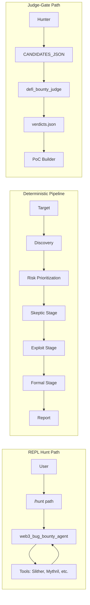

# Security Architecture Review — CAI Web3 Vulnerability Hunting System

Full-scope security architecture review of the CAI cognitive system: agent roles, data and decision flow, validation, hallucinations and false positives, weakness analysis, guardrails and principles, and hunting capability evaluation.

---

## A. System Architecture Map

### Agent roles and placement

| Role                  | Agents / components                                                                      | Responsibility                                                                                                    |
| --------------------- | ---------------------------------------------------------------------------------------- | ----------------------------------------------------------------------------------------------------------------- |
| **Hunter**            | `web3_bug_bounty_agent`, `web3_gctr_agent`, `web3_discovery_agent`, `elite_web3_auditor` | Creative discovery; tool-calling; outputs CANDIDATES_JSON when in Judge-Gate flow                                 |
| **Judge gate**        | `defi_bounty_judge_agent`                                                                | Exploitability filter; verdicts: EXPLOITABLE / MITIGATED / THEORETICAL / INVALID; requires concrete call sequence |
| **Skeptics**          | `skeptic_alpha`, `skeptic_beta`, `skeptic_gamma` (prompt-based)                          | Adversarial review in patterns; in **EliteWeb3Pipeline** only rule-based skeptic (owner-only, no external calls)  |
| **Synthesis**         | `exploit_synthesizer`, `poc_generator`, `retester_agent`                               | PoC/Foundry test generation for EXPLOITABLE-only (Judge-Gate) or pipeline survivors                              |
| **Orchestration**     | Planner, Manager Vuln/Economic/Access, Attributor, Critic                                | Pre-Act planning; specialized analysis; scoring; taxonomy (SWC/DASP)                                               |
| **Reasoning / pivot** | `reasoner_support`, `thought_agent`, `PivotEngine`                                      | Hypothesis tracking; modality switch (static → fuzz → symbolic); Grit loop in prompts                             |

**Key files:** [src/cai/agents/__init__.py](src/cai/agents/__init__.py), [src/cai/agents/factory.py](src/cai/agents/factory.py), [src/cai/agents/patterns/__init__.py](src/cai/agents/patterns/__init__.py), [docs/agents/web3/overview.md](docs/agents/web3/overview.md).

### Data flow

- **REPL /hunt:** User runs `/hunt <path>` → workspace + agent set to `web3_bug_bounty_agent`. No automatic pipeline; user drives conversation; agent uses tools (Slither, Mythril, validate_finding, fork_test, etc.) and may output CANDIDATES_JSON for manual paste to Judge.
- **EliteWeb3Pipeline (programmatic):** [src/cai/web3/pipeline.py](src/cai/web3/pipeline.py) — Discovery (Slither + precision detectors) → Risk prioritization (weighted score) → Skeptic (rule-based only) → Exploit (generate_fork_test → run_fork_test → analyze_test_output) → Formal (invariant_broken by type) → Report. Invoked via `EliteWeb3Pipeline().run(target)` (e.g. [src/web3_security_ai/main.py](src/web3_security_ai/main.py)); **not** wired to `/hunt` REPL.
- **Judge-Gate:** Hunter (any pattern that emits CANDIDATES_JSON) → Judge agent (structured VerdictList) → only EXPLOITABLE → PoC. Handoff is manual or via parallel/sequential patterns; no automatic "Hunter finished → invoke Judge" in REPL.

### Decision flow

- **Per turn (Runner):** [src/cai/sdk/agents/run.py](src/cai/sdk/agents/run.py), [src/cai/sdk/agents/_run_impl.py](src/cai/sdk/agents/_run_impl.py). Model response → `ProcessedResponse` (functions, handoffs, computer_actions) → execute tools → then: handoff (switch agent), final output (return), or next turn (same agent). Decision to stop or hand off is **model-driven** (no deterministic "after N findings, go to Judge").
- **Pipeline:** Decisions are deterministic within stages: discovery always runs; risk formula fixed; skeptic uses two rules; exploit stage passes/fails per finding via fork test result; formal stage uses hardcoded vulnerability_type list for `invariant_broken`.

### Validation flow

| Layer                      | What is validated            | How                                                                                                                                                                                                                       |
| -------------------------- | ---------------------------- | ------------------------------------------------------------------------------------------------------------------------------------------------------------------------------------------------------------------------- |
| **validate_finding**       | Single finding (tool output) | [src/cai/tools/web3_security/validate_findings.py](src/cai/tools/web3_security/validate_findings.py): regex false-positive patterns, noise patterns, tool-specific patterns → is_valid, confidence, reasoning             |
| **Enhancement validation** | Finding + code context       | [src/cai/tools/web3_security/enhancements/validation.py](src/cai/tools/web3_security/enhancements/validation.py): FALSE_POSITIVE_PATTERNS, TOOL_RELIABILITY; condition checks (view/pure, access control, return checked) |
| **Council**                | Aggregated findings          | [src/cai/tools/web3_security/council.py](src/cai/tools/web3_security/council.py): dedupe by key, average confidence → Confirmed / Needs Review / Likely FP                                                                |
| **Judge**                  | Candidate (Hunter output)    | [src/cai/agents/defi_bounty_judge.py](src/cai/agents/defi_bounty_judge.py): LLM + VerdictList; requires attack_path, preconditions, impact; INVALID if no call sequence                                                   |
| **Pipeline exploit stage** | Each finding                 | [src/cai/web3/pipeline.py](src/cai/web3/pipeline.py): generate_fork_test(hypothesis) → run_fork_test → analyze_test_output; exploit_succeeded and profit > 0 required                                                     |

### Where hallucinations can occur

1. **Hunter agent:** Free-form tool choice and interpretation of Slither/Mythril/etc. output; may infer vulnerabilities not present in tool output or invent code paths.
2. **Judge agent:** Verdict and attack_path are LLM-generated; can label INVALID as EXPLOITABLE or vice versa; attack_path may be non-executable.
3. **Fork test generation:** [src/cai/tools/web3_security/fork_test.py](src/cai/tools/web3_security/fork_test.py) — Hypothesis is string; exploit steps are **template-based** (oracle/reentrancy/flash loan) or "TODO: Implement exploit steps"; no parsing of actual contract ABI or finding location. The "exploit" is generic, not derived from the finding.
4. **Reasoning tools / thought:** [src/cai/tools/misc/reasoning.py](src/cai/tools/misc/reasoning.py) — `thought`, `write_key_findings`; state in `state.txt` is LLM-written; can be inconsistent with tool evidence.
5. **Pipeline formal stage:** [src/cai/web3/pipeline.py](src/cai/web3/pipeline.py) (lines 278–294) — `invariant_broken` set to True only for hardcoded types (reentrancy, overflow, precision_loss, oracle-manipulation); no formal proof; classification is heuristic.

### Where false positives originate

1. **Static tools:** Slither/Mythril/Securify known FPs (reentrancy-benign, view/pure, timestamp equality, etc.); pipeline and validate_finding try to filter via patterns but coverage is partial.
2. **Hunter over-claiming:** Agent may report "possible reentrancy" without tool support or with misread line numbers.
3. **Fork test template:** Generic oracle/reentrancy/flash-loan stubs can "succeed" (e.g. test passes for wrong reason) or fail for wrong reason; profit check is simplistic (1.0 - gas_cost).
4. **Skeptic stage (pipeline):** Only two rules; no LLM skeptic in pipeline; many FP patterns never filtered.
5. **Council:** Confidence averaging and "Needs Review" bucket; no guarantee that Confirmed = true positive.

### Where exploits would be missed

1. **Pipeline not used in /hunt:** REPL hunt path does not run EliteWeb3Pipeline; discovery and fork verification are only in programmatic path. User-driven hunt has no mandatory fork step unless the agent chooses to call fork_test.
2. **Fork test is generic:** Exploit steps are not generated from the actual finding (contract, function, line); unknown or custom vulnerability types fall into "TODO: Implement exploit steps" and fail → finding rejected.
3. **Formal stage:** Only four vulnerability_type values get invariant_broken=True; other types (e.g. access control, governance) are set to severity=medium and invariant_broken=False; critical gate (is_critical) requires fork_verified and invariant_broken.
4. **Judge not auto-invoked:** If user never passes CANDIDATES_JSON to Judge, no exploitability gate; Hunter output can go straight to reporting or PoC without filtering.
5. **Tool ordering and coverage:** Agent may skip fuzz/symbolic or never call validate_finding/council; no enforced "minimum verification set."
6. **Single-run mindset:** PivotEngine and Grit prompts encourage pivoting, but the run loop does not enforce "exhaust hypothesis list" or "run Judge on every candidate"; easy to stop after first finding or miss deep chains.

---

## B. Weakness Analysis

### Shallow reasoning loops

- **Pipeline skeptic stage:** No LLM; two simple rules (owner-only reject; no external calls + no state vars reject). No "challenge assumption chain" or "prove unreachability."
- **Fork test:** One attempt per finding with a template; no iterative refinement of hypothesis (e.g. "reentrancy failed → try cross-function reentrancy").
- **Formal stage:** No real invariant reasoning; hardcoded type → invariant_broken flag; no Echidna/Certora or symbolic proof.

### Lack of adversarial verification

- **Pipeline:** No skeptic agents in EliteWeb3Pipeline; only rule-based filters. Adversarial skeptics exist in patterns (e.g. Aegis) but are not used in the deterministic pipeline.
- **Judge-Gate:** Judge is single-shot LLM; no "red team" that tries to disprove the attack path or run a counter-PoC.
- **Fork test:** No check that the test actually exercises the claimed vulnerability (e.g. assert balance change); success is inferred from analysis output and profit formula.

### Missing invariant reasoning

- **No systematic invariants:** Beyond formal_stage type list, there is no protocol-level invariant definition (e.g. "totalSupply == sum(balances)") or automated invariant testing in the main pipeline.
- **Echidna/Medusa/Certora:** Available as tools but not wired into pipeline as required steps; agent may or may not call them; no "invariant hold/fail" driving accept/reject.

### Tool misuse

- **Wrong tool for question:** Agent can call Mythril for style issues or Slither for fuzzing; prompts guide but do not enforce tool–stage mapping.
- **Tool output ignored or misparsed:** LLM may summarize "Slither found 3 issues" and then report 5; no structured extraction (e.g. parse Slither JSON and map to Finding) in the loop.
- **Fork test contract_path/contract_name:** Pipeline passes finding.contract (string) as contract_path and contract_name; if Finding has only contract name (not path), test generation may point to wrong file or placeholder.

### Non-deterministic decision paths

- **When to stop:** Model decides NextStepFinalOutput; can stop after one finding or run for many turns; no "stop only when Judge says EXPLOITABLE or hypothesis space exhausted."
- **Which findings to send to Judge:** Hunter must emit CANDIDATES_JSON; format is prompt-driven; no guarantee all tool-derived findings are included or that candidates are deduplicated.
- **Tool choice per turn:** Non-deterministic; same input can lead to different tool sequences and thus different findings.

### Premature conclusions

- **"Exploit succeeded":** Fork test analysis (analyze_test_output) is the gate; if the template test passes (e.g. compiles and runs), finding is marked fork_verified; the test may not implement the real exploit.
- **Critical finding:** is_critical() requires fork_verified, invariant_broken, economic_profitability > 0, consensus_score >= 0.85; invariant_broken is set by type in formal stage, so many real bugs never get invariant_broken=True and are never "critical" in report.
- **Judge EXPLOITABLE:** No automatic PoC run after verdict; human or PoC builder may find the attack path is wrong.

### Inability to prove exploitability

- **No mandatory PoC run for Judge EXPLOITABLE:** Judge output is trusted; no "run PoC and confirm" step in the Judge-Gate flow unless a separate PoC step is run.
- **Fork test does not encode finding:** Hypothesis is a short string; generate_fork_test does not receive Finding object (location, call_trace, state_variables); generated test is generic.
- **Economic profitability:** Pipeline uses fixed gas and 1.0 - gas_cost as profit; no real mainnet fork profit measurement or MEV simulation.

---

## C. Guardrails & Principles (Auditing Methodology)

The following are rules the **framework and its usage** should follow to act as a reliable vulnerability discovery system (auditing methodology, not coding style).

1. **Exploitability over severity.** A finding is not accepted until there is a concrete, permissionless attack path (call sequence with contract.function(), preconditions, and measurable impact). No "theoretical" or "would be bad if" in the accepted set.
2. **Single source of truth for tool output.** Findings that reach the Judge or the report must be traceable to at least one tool output (Slither, Mythril, etc.) with location and type; no free-form "I think there's a bug" without tool evidence.
3. **Mandatory adversarial gate before PoC.** Every candidate that is to receive a PoC or "verified" label must pass an exploitability gate (Judge or equivalent) that requires attack path and preconditions; INVALID or no call sequence → do not build PoC.
4. **Fork verification must be finding-specific.** Any "fork verified" or "exploit succeeded" must come from a test that is generated from the specific finding (contract, function, location/line), not a generic template. If the test cannot be generated from the finding, the finding must not be marked fork_verified.
5. **Invariant reasoning when claiming invariant violation.** If the system or report claims "invariant broken," that claim must be backed by an invariant definition and a failing run (e.g. Echidna/Certora/property test) or explicit reasoning; no invariant_broken by vulnerability_type alone.
6. **False-positive filters must be explicit and auditable.** Every filter (skeptic, validate_finding, council, pipeline rules) must be documentable (pattern, rule, or threshold); no "LLM said it's FP" as the only filter.
7. **No premature "critical" or "exploit verified."** Critical/verified status requires: (a) exploitability gate passed, (b) finding-specific PoC or fork test that demonstrates impact, (c) economic viability check when relevant (e.g. profit > cost), and (d) no reliance on generic stub tests.
8. **Human-in-the-loop at verdict and before report.** At least one of: (1) human confirms Judge EXPLOITABLE list before PoC build, or (2) human confirms "verified" findings before report delivery. Ctrl+C and "Needs Manual Review" are existing HITL points; they should be used for any high-impact claim.
9. **Hypothesis exhaustion for "no findings."** Before concluding "no exploitable bugs," the process must document pivots (modality, surface, assumption inversions) and show that key hypotheses were tested (e.g. via PivotEngine or equivalent log).
10. **Reproducibility.** Every reported finding must have: (a) target (repo/path or commit), (b) tool(s) and versions that produced it, (c) steps to reproduce (or PoC), and (d) clear impact statement. No finding without reproducible steps.

---

## D. Hunting Capability Evaluation

| Capability                    | Current state                                                                                                                              | Gap                                                                                                                                                                                    |
| ----------------------------- | ------------------------------------------------------------------------------------------------------------------------------------------ | -------------------------------------------------------------------------------------------------------------------------------------------------------------------------------------- |
| **Permissionless fund theft** | Hunter + tools can surface reentrancy, access control, etc.; Judge requires concrete call sequence; pipeline fork stage uses generic test. | Fork test is not finding-specific; many theft vectors will fail the generic stub and be rejected, or pass for wrong reason. Pipeline skeptic is too weak; FPs can reach exploit stage. |
| **Logic flaws**               | Static tools and enhancement validation cover many patterns; Critic/skeptics in patterns add scoring.                                      | No mandatory logic-flaw taxonomy (e.g. SWC) in pipeline; formal stage does not reason about logic, only type.                                                                          |
| **Economic exploits**         | Manager Economic, MEV analyzer, profit check in pipeline (profit > 0).                                                                     | Profit = 1.0 - gas_cost (simplistic); no flash-loan or MEV simulation in pipeline; economic viability is heuristic.                                                                    |
| **Reduce false positives**    | validate_finding, enhancement validation, council, Judge INVALID, pipeline skeptic.                                                         | Skeptic in pipeline is minimal; council and validation are best-effort; no adversarial LLM in pipeline; Judge can still hallucinate EXPLOITABLE.                                      |
| **Reproducible PoCs**         | Fork test generates Foundry test; exploit_synthesizer and retester build PoC for Judge EXPLOITABLE.                                        | Generated test is template-based and not tied to Finding fields; PoC builder may not re-run and confirm; no "PoC run passed" as mandatory gate in pipeline.                             |

**Summary:** The system has strong **ingredients** (Judge prompt, Grit mindset, many tools, pipeline stages, validation layers) but **structural gaps**: (1) REPL hunt and deterministic pipeline are disconnected; (2) fork verification is not finding-aware; (3) formal/invariant and skeptic stages are shallow; (4) no mandatory "Judge → PoC run → confirm" loop; (5) economic and invariant reasoning are heuristic. To be a **reliable** vulnerability discovery system, the framework should enforce finding-specific PoC generation, an adversarial or proof-backed step for invariant/exploitability, and explicit HITL at verdict/report.
