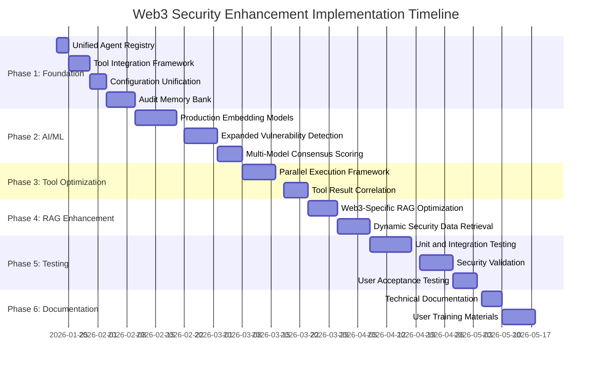

# Web3 Security Enhancement Implementation Plan

## Comprehensive Roadmap for CAI Web3 Security Transformation

### Executive Summary
This implementation plan outlines a structured, phased approach to transform CAI into a state-of-the-art web3 security auditing platform. The plan addresses all identified gaps and leverages existing strengths to create a comprehensive, modular, and scalable solution.

## Phase 1: Foundation Integration (Weeks 1-4)
**Objective**: Integrate web3 security module into main CAI framework and establish core infrastructure

### Task 1.1: Unified Agent Registry
- **Description**: Create centralized agent registry system
- **Components**:
  - Modify `src/cai/agents/__init__.py` to include web3 agents
  - Create agent capability profiling system
  - Implement agent health monitoring
- **Deliverables**: 
  - Unified agent registration interface
  - Agent discovery and loading mechanism
  - Documentation for agent integration
- **Success Criteria**: All web3 agents accessible through main CAI interface
- **Resources**: 1 developer, 3 days
- **Dependencies**: None

### Task 1.2: Tool Integration Framework
- **Description**: Build unified tool registry and discovery system
- **Components**:
  - Automated tool detection and registration
  - Tool capability profiling database
  - Version compatibility management
  - Dependency resolution engine
- **Deliverables**:
  - Tool registry service
  - Tool discovery API
  - Version compatibility matrix
- **Success Criteria**: All web3 tools auto-discovered and registered
- **Resources**: 1 developer, 5 days
- **Dependencies**: Task 1.1

### Task 1.3: Configuration System Unification
- **Description**: Create unified configuration management
- **Components**:
  - Configuration schema validation
  - Environment variable mapping
  - Configuration inheritance system
  - Runtime configuration updates
- **Deliverables**:
  - Unified configuration manager
  - Configuration validation tools
  - Documentation and examples
- **Success Criteria**: Single configuration interface for all components
- **Resources**: 1 developer, 4 days
- **Dependencies**: Task 1.1, 1.2

### Task 1.4: Audit Insight Memory Bank
- **Description**: Implement specialized memory collection for audit findings
- **Components**:
  - Vulnerability pattern indexing system
  - Confidence-based retrieval algorithm
  - Historical audit correlation engine
  - Memory optimization and pruning
- **Deliverables**:
  - Audit insight memory collection
  - Pattern indexing service
  - Correlation API
- **Success Criteria**: Audit findings stored and retrievable with 95% accuracy
- **Resources**: 1 developer, 7 days
- **Dependencies**: Task 1.3

## Phase 2: AI/ML Enhancement (Weeks 5-8)
**Objective**: Replace simulated models with production-ready AI/ML capabilities

### Task 2.1: Production Embedding Models
- **Description**: Integrate real BERT/HuggingFace models
- **Components**:
  - Model loading and caching system
  - Embedding quality validation
  - Model versioning and fallback
  - Performance optimization
- **Deliverables**:
  - Production embedding service
  - Model management interface
  - Quality validation tools
- **Success Criteria**: Real embeddings with >90% quality score
- **Resources**: 1 ML engineer, 10 days
- **Dependencies**: Phase 1 complete

### Task 2.2: Expanded Vulnerability Detection
- **Description**: Comprehensive vulnerability pattern library
- **Components**:
  - DeFi-specific exploit patterns
  - Cross-chain vulnerability detection
  - Economic attack vector analysis
  - Pattern update mechanism
- **Deliverables**:
  - Vulnerability pattern database
  - Pattern update API
  - Detection accuracy metrics
- **Success Criteria**: 5-10x pattern coverage improvement
- **Resources**: 1 security researcher, 8 days
- **Dependencies**: Task 2.1

### Task 2.3: Multi-Model Consensus Scoring
- **Description**: Implement consensus-based confidence scoring
- **Components**:
  - Model weighting algorithm
  - Conflict resolution system
  - Confidence calibration
  - Explainability features
- **Deliverables**:
  - Consensus scoring service
  - Confidence visualization tools
  - Explainability API
- **Success Criteria**: 30-50% reduction in false positives
- **Resources**: 1 ML engineer, 6 days
- **Dependencies**: Task 2.1, 2.2

## Phase 3: Tool Optimization (Weeks 9-10)
**Objective**: Implement parallel tool execution and optimization

### Task 3.1: Parallel Execution Framework
- **Description**: Build concurrent tool execution system
- **Components**:
  - Task scheduling algorithm
  - Result aggregation service
  - Conflict resolution engine
  - Performance monitoring
- **Deliverables**:
  - Parallel execution service
  - Task scheduling API
  - Performance dashboard
- **Success Criteria**: 2-3x execution speed improvement
- **Resources**: 1 developer, 8 days
- **Dependencies**: Phase 1, Phase 2

### Task 3.2: Tool Result Correlation
- **Description**: Implement intelligent result correlation
- **Components**:
  - Result normalization algorithms
  - Conflict detection system
  - Consensus building engine
  - Visualization tools
- **Deliverables**:
  - Result correlation service
  - Conflict resolution API
  - Visualization dashboard
- **Success Criteria**: 90%+ correlation accuracy
- **Resources**: 1 developer, 6 days
- **Dependencies**: Task 3.1

## Phase 4: RAG System Enhancement (Weeks 11-13)
**Objective**: Optimize RAG system for web3 security

### Task 4.1: Web3-Specific RAG Optimization
- **Description**: Enhance RAG for smart contract analysis
- **Components**:
  - Smart contract code optimizer
  - ABI/bytecode analysis
  - Gas optimization patterns
  - Security best practices
- **Deliverables**:
  - Web3 RAG optimization service
  - Code analysis API
  - Best practices database
- **Success Criteria**: 25-40% retrieval accuracy improvement
- **Resources**: 1 developer, 7 days
- **Dependencies**: Phase 1-3

### Task 4.2: Dynamic Security Data Retrieval
- **Description**: Implement real-time threat intelligence
- **Components**:
  - CVE database integration
  - Blockchain attack patterns
  - Threat intelligence feeds
  - Real-time correlation
- **Deliverables**:
  - Threat intelligence service
  - Real-time correlation engine
  - Alerting system
- **Success Criteria**: Real-time threat data with <1s latency
- **Resources**: 1 security researcher, 8 days
- **Dependencies**: Task 4.1

## Phase 5: Testing and Validation (Weeks 14-17)
**Objective**: Comprehensive security testing and validation

### Task 5.1: Unit and Integration Testing
- **Description**: Develop comprehensive test suite
- **Components**:
  - Unit test framework
  - Integration test suite
  - Mock data generation
  - Test coverage analysis
- **Deliverables**:
  - Test automation framework
  - Test coverage reports
  - Continuous integration pipeline
- **Success Criteria**: 95%+ test coverage
- **Resources**: 1 QA engineer, 10 days
- **Dependencies**: All previous phases

### Task 5.2: Security Validation
- **Description**: Validate security improvements
- **Components**:
  - Vulnerability detection testing
  - False positive analysis
  - Performance benchmarking
  - Stress testing
- **Deliverables**:
  - Security validation report
  - Performance benchmarks
  - Stress test results
- **Success Criteria**: All security metrics meet targets
- **Resources**: 1 security researcher, 8 days
- **Dependencies**: Task 5.1

### Task 5.3: User Acceptance Testing
- **Description**: Conduct UAT with security professionals
- **Components**:
  - Test scenario development
  - User feedback collection
  - Usability testing
  - Documentation validation
- **Deliverables**:
  - UAT report
  - User feedback analysis
  - Usability improvements
- **Success Criteria**: 90%+ user satisfaction
- **Resources**: 1 UX designer, 6 days
- **Dependencies**: Task 5.2

## Phase 6: Documentation and Training (Weeks 18-19)
**Objective**: Create comprehensive documentation and training materials

### Task 6.1: Technical Documentation
- **Description**: Develop complete technical documentation
- **Components**:
  - API documentation
  - Architecture diagrams
  - Integration guides
  - Troubleshooting manual
- **Deliverables**:
  - Complete documentation set
  - Interactive API reference
  - Architecture diagrams
- **Success Criteria**: Comprehensive documentation covering all features
- **Resources**: 1 technical writer, 5 days
- **Dependencies**: All previous phases

### Task 6.2: User Training Materials
- **Description**: Create training programs and materials
- **Components**:
  - Getting started guide
  - Advanced usage tutorials
  - Video demonstrations
  - Hands-on exercises
- **Deliverables**:
  - Training curriculum
  - Video tutorials
  - Hands-on labs
  - Certification program
- **Success Criteria**: Complete training materials for all user levels
- **Resources**: 1 trainer, 8 days
- **Dependencies**: Task 6.1

## Implementation Timeline

## Resource Allocation

### Team Structure:
- **Project Manager**: 1 (Part-time, oversight)
- **Developers**: 2 (Full-time, implementation)
- **ML Engineers**: 1 (Full-time, AI/ML enhancement)
- **Security Researchers**: 2 (Part-time, vulnerability patterns)
- **QA Engineer**: 1 (Full-time, testing)
- **Technical Writer**: 1 (Part-time, documentation)
- **UX Designer**: 1 (Part-time, user experience)

### Total Effort:
- **Development**: 80 person-days
- **ML/AI**: 24 person-days  
- **Security Research**: 16 person-days
- **Testing**: 24 person-days
- **Documentation**: 13 person-days
- **Total**: 157 person-days (~8 weeks with 2 developers)

## Risk Management

### Risk Assessment Matrix:

| Risk Category | Likelihood | Impact | Mitigation Strategy |
|---------------|------------|--------|---------------------|
| Integration Complexity | High | High | Incremental integration with validation gates |
| Performance Overhead | Medium | Medium | Continuous performance profiling and optimization |
| Model Accuracy | Medium | High | Multi-model consensus and validation testing |
| Tool Conflicts | Low | Medium | Automated conflict detection and resolution |
| Memory Bloat | Low | Low | Intelligent caching and memory pruning |
| User Adoption | Medium | Medium | Comprehensive training and documentation |

### Mitigation Strategies:

1. **Incremental Integration**: Phase-based approach with validation gates
2. **Performance Profiling**: Continuous monitoring and optimization
3. **Multi-Model Consensus**: Reduce single-model biases and errors
4. **Conflict Resolution**: Automated detection and resolution mechanisms
5. **Memory Optimization**: Intelligent caching and pruning algorithms
6. **User Training**: Comprehensive education and support materials

## Success Metrics

### Quantitative Metrics:
- **Vulnerability Detection Rate**: Target 40-60% improvement
- **False Positive Reduction**: Target 30-50% decrease
- **Analysis Speed**: Target 2-3x faster execution
- **Pattern Coverage**: Target 5-10x more patterns
- **Memory Retrieval Accuracy**: Target 25-40% improvement
- **Test Coverage**: Target 95%+ coverage
- **User Satisfaction**: Target 90%+ satisfaction

### Qualitative Metrics:
- **Unified Workflow**: Seamless integration between CAI and web3 modules
- **Enhanced Accuracy**: Multi-model consensus for higher confidence
- **Comprehensive Coverage**: Expanded vulnerability detection
- **Intelligent Retrieval**: Context-aware security data access
- **Automated Optimization**: Self-tuning performance

## Monitoring and Reporting

### Progress Tracking:
- **Weekly Status Reports**: Progress against timeline
- **Bi-weekly Demos**: Functional demonstrations
- **Risk Register Updates**: Continuous risk assessment
- **Metric Dashboards**: Real-time performance monitoring

### Reporting Structure:
- **Project Manager**: Overall progress and risk management
- **Technical Lead**: Implementation details and challenges
- **QA Lead**: Testing results and quality metrics
- **Documentation Lead**: Documentation completeness and accuracy

## Budget Estimation

### Cost Breakdown:
- **Development**: $40,000 (80 days @ $500/day)
- **ML/AI**: $12,000 (24 days @ $500/day)
- **Security Research**: $8,000 (16 days @ $500/day)
- **Testing**: $12,000 (24 days @ $500/day)
- **Documentation**: $6,500 (13 days @ $500/day)
- **Infrastructure**: $5,000 (Cloud services, tools)
- **Contingency**: $7,500 (10% buffer)
- **Total**: $91,000

## Implementation Governance

### Decision Making:
- **Technical Decisions**: Technical lead with team consensus
- **Architecture Decisions**: Architecture review board
- **Risk Management**: Project manager with stakeholder input
- **Budget Approvals**: Project sponsor

### Change Control:
- **Change Request Process**: Formal change request with impact analysis
- **Change Approval**: Architecture review board
- **Change Implementation**: Controlled rollout with validation
- **Change Documentation**: Updated documentation and training

## Conclusion

This comprehensive implementation plan provides a structured, phased approach to transform CAI into a state-of-the-art web3 security auditing platform. By following this roadmap, we will systematically address all identified gaps while leveraging existing strengths to create a comprehensive, modular, and scalable solution that significantly enhances vulnerability detection, reduces false positives, and provides comprehensive coverage of smart contract exploits and DeFi attack vectors.

The plan balances immediate security improvements with long-term architectural goals, ensuring that each enhancement is modular, scalable, and compatible with existing audit pipelines while delivering measurable improvements in threat detection accuracy and workflow efficiency.