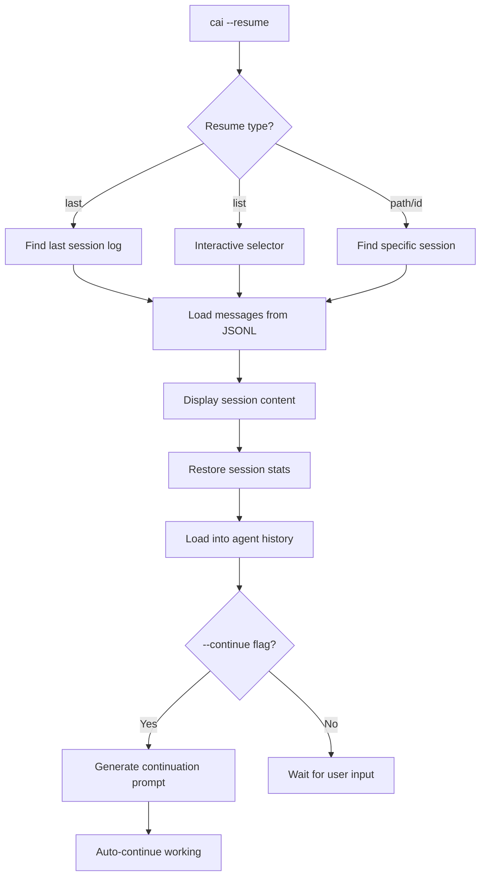

# Session Resume

## Overview

CAI provides powerful session resume capabilities that allow you to continue where you left off. Whether you were in the middle of a security audit, bug bounty session, or complex analysis, you can seamlessly restore your conversation history and pick up exactly where you stopped.

The session resume system automatically saves all your interactions to JSONL log files and provides multiple ways to restore them:

- **`--resume`**: Resume from specific session or interactive selector
- **`--resume --continue`**: Resume AND continue autonomously
- **Interactive Selector**: Visual session browser with pagination

## Quick Start

```bash
# Resume the last session
cai --resume

# Resume the last session and continue autonomously
cai --resume --continue

# Interactive session selector
cai --resume list

# Resume a specific session by ID
cai --resume abc12345

# Resume from a specific log file
cai --resume /path/to/session.jsonl
```

## Session Resume Options

### Resume Last Session

```bash
cai --resume
# or
cai --resume last
```

This automatically finds and loads the most recent session that contains messages. Empty sessions are skipped.

### Interactive Session Selector

```bash
cai --resume list
```

Opens an interactive menu with:

- **Arrow key navigation** (`↑`/`↓` or `j`/`k`)
- **Page navigation** (`←`/`→` or `h`/`l`)
- **Session preview** showing last assistant response
- **Cost and token tracking** per session
- **Model information** for each session

```
╭──────────────────────────────────────────────────────────────────────────────╮
│  ↻ Select a session to resume                                                │
│  ↑/↓/j/k navigate  │  ←/→/h/l pages  │  Enter select  │  q/Esc cancel       │
╰──────────────────────────────────────────────────────────────────────────────╯

   Page 1+ │ 10 sessions │ → next

   ID       │ Date       │ Model        │ Msgs    │ Cost
   ─────────┼────────────┼──────────────┼─────────┼────────
 ❯ abc12345 │ 01-12 15:30 │ claude-sonnet │  42 msgs │   $2.35 ★ LATEST
   def67890 │ 01-12 14:15 │ gpt-4         │  28 msgs │   $1.80
   ghi11223 │ 01-11 20:00 │ claude-opus   │ 156 msgs │  $12.50

   ──────────────────────────────────────────────────────────────────
   Preview:
   The vulnerability analysis is complete. I found 3 critical issues:
   1. SQL injection in user.py line 45...
```

### Resume with Continue Mode

```bash
cai --resume --continue
# or
cai --resume -c
```

This powerful combination:
1. **Restores your previous session** with full conversation history
2. **Automatically generates a continuation prompt** based on context
3. **Continues working autonomously** without waiting for user input

Perfect for:
- Resuming long-running security audits
- Continuing interrupted penetration tests
- Picking up complex analysis tasks

### Resume Specific Session

```bash
# By session ID (first 8 characters)
cai --resume abc12345

# By full log file path
cai --resume logs/cai_20240112_153045.jsonl

# From custom logs directory
cai --resume my_session --logpath ~/custom_logs/
```

## What Gets Restored

When you resume a session, CAI restores:

| Component | Description |
|-----------|-------------|
| **Message History** | All user messages and agent responses |
| **Tool Calls** | Complete record of tools used and their outputs |
| **Agent Context** | The agent's understanding of the task |
| **Session Statistics** | Total cost, tokens used, active time |
| **Parallel Agent Config** | Multi-agent configurations (if applicable) |

### Session Statistics Display

```
↻ Resuming session
claude-sonnet │ Tokens: 45,230in/12,450out │ $3.45 │ 25.3s active

[Session content displayed here...]

Session restored. Continue where you left off.
Restored session stats: $3.4500, 45230in/12450out tokens
Loaded 156 messages into agent history
```

## Custom Logs Directory

Use `--logpath` to work with sessions stored in custom directories:

```bash
# Resume from custom directory
cai --resume list --logpath ~/projects/security_audits/logs/

# Resume last session from custom directory
cai --resume --logpath /shared/team_sessions/
```

The `--logpath` option:
- Recursively searches all subdirectories for `.jsonl` files
- Works with both `--resume list` and `--resume last`
- Supports absolute and relative paths

## Parallel Agent Sessions

When resuming a session that used multiple parallel agents, CAI automatically detects and offers to restore the parallel configuration:

```
The session used 3 parallel agents:
  - CTF agent
  - Code Analyzer agent
  - Security Researcher agent

Set up the same parallel agent configuration? (y/n):
```

If you choose yes, the parallel agent configuration is restored and you can continue working with the same multi-agent setup.

## Session Log Format

Sessions are stored as JSONL (JSON Lines) files in the `logs/` directory:

```
logs/
├── last -> cai_20240112_153045.jsonl  # Symlink to most recent
├── cai_20240112_153045.jsonl
├── cai_20240112_140000.jsonl
└── cai_20240111_200000.jsonl
```

Each log file contains:
- Session metadata (ID, timestamps, model info)
- Complete message history
- Tool calls and responses
- Token usage and cost tracking
- Timing metrics (active/idle time)

## Environment Variables

```bash
# Custom default logs directory
export CAI_LOGS_DIR=~/my_logs

# Enable debug output for resume operations
export CAI_DEBUG=2
```

## Programmatic Usage

### Python API

```python
from cai.repl.session_resume import (
    resume_session,
    find_last_session_log,
    interactive_session_selector,
    load_session_into_agent
)

# Find and display session
log_path = find_last_session_log()
messages, used_path, parallel_agents = resume_session(log_path)

# Load into agent
from cai.agents import get_agent_by_name
agent = get_agent_by_name("ctf_agent")
load_session_into_agent(agent, messages, log_path=used_path)
```

### List Recent Sessions

```python
from cai.repl.session_resume import list_recent_sessions

sessions = list_recent_sessions(limit=10)
for session in sessions:
    print(f"{session['session_id'][:8]} - {session['model']} - ${session['total_cost']:.2f}")
```

## Best Practices

### 1. Regular Session Checkpoints

For long-running tasks, the session is automatically saved after each interaction. You can safely interrupt with `Ctrl+C` and resume later.

### 2. Descriptive Initial Prompts

When starting a session you plan to resume later, use descriptive prompts that provide context:

```bash
# Good - Clear context for resumption
cai --prompt "Security audit of user authentication in project X, focusing on SQL injection and XSS"

# Less helpful for resumption
cai --prompt "check auth"
```

### 3. Use Resume + Continue for Autonomous Work

```bash
# Start a long task
cai --continue --prompt "comprehensive security audit of the entire codebase"

# Later, resume and let it continue working
cai --resume --continue
```

### 4. Organize Sessions with Custom Paths

```bash
# Keep different projects separate
cai --prompt "audit project A" --logpath ~/logs/project_a/
cai --prompt "audit project B" --logpath ~/logs/project_b/

# Resume specific project
cai --resume --logpath ~/logs/project_a/
```

## Troubleshooting

### Issue: "No previous session found"

**Cause**: No valid session logs exist in the logs directory.

**Solutions**:
- Check the `logs/` directory exists and contains `.jsonl` files
- Use `--logpath` to specify a custom directory
- Ensure previous sessions completed at least one interaction

### Issue: Session loads but context seems lost

**Cause**: The model's context window may be exceeded.

**Solutions**:
- Resume with a model that has a larger context window
- The session will work but older messages may be truncated by the model

### Issue: Parallel agents not detected

**Cause**: The original session may not have used the parallel agent format.

**Solutions**:
- Manually configure parallel agents with `/parallel` command after resuming
- Check that the original session used proper parallel agent configuration

### Issue: Cost tracking shows $0.00 after resume

**Cause**: Session stats couldn't be restored from the log file.

**Solutions**:
- This is cosmetic; the actual costs are still in the log file
- Check log file format is valid JSONL

## Technical Details

### Session Resume Flow



### Core Components

| File | Purpose |
|------|---------|
| `src/cai/repl/session_resume.py` | Main resume functionality |
| `src/cai/sdk/agents/run_to_jsonl.py` | JSONL parsing and token stats |
| `src/cai/cli.py` | CLI integration and `--resume` handling |

### Log File Structure

```json
{"event": "session_start", "session_id": "abc12345", "timestamp": "2024-01-12T15:30:45Z"}
{"object": "chat.completion", "model": "claude-sonnet", "messages": [...], "agent_name": "CTF agent"}
{"event": "tool_call", "name": "generic_linux_command", "arguments": {...}}
{"event": "session_end", "cost": {"total_cost": 3.45}, "timing_metrics": {...}}
```

## Summary

Session resume in CAI provides:

- **Seamless continuation** of interrupted work
- **Full context restoration** including tools and agent state
- **Interactive session browsing** with preview and filtering
- **Autonomous resumption** with `--resume --continue`
- **Multi-agent support** for parallel session restoration
- **Flexible log management** with custom directories

Whether you're conducting security audits, running penetration tests, or performing complex analysis, session resume ensures you never lose your progress.
